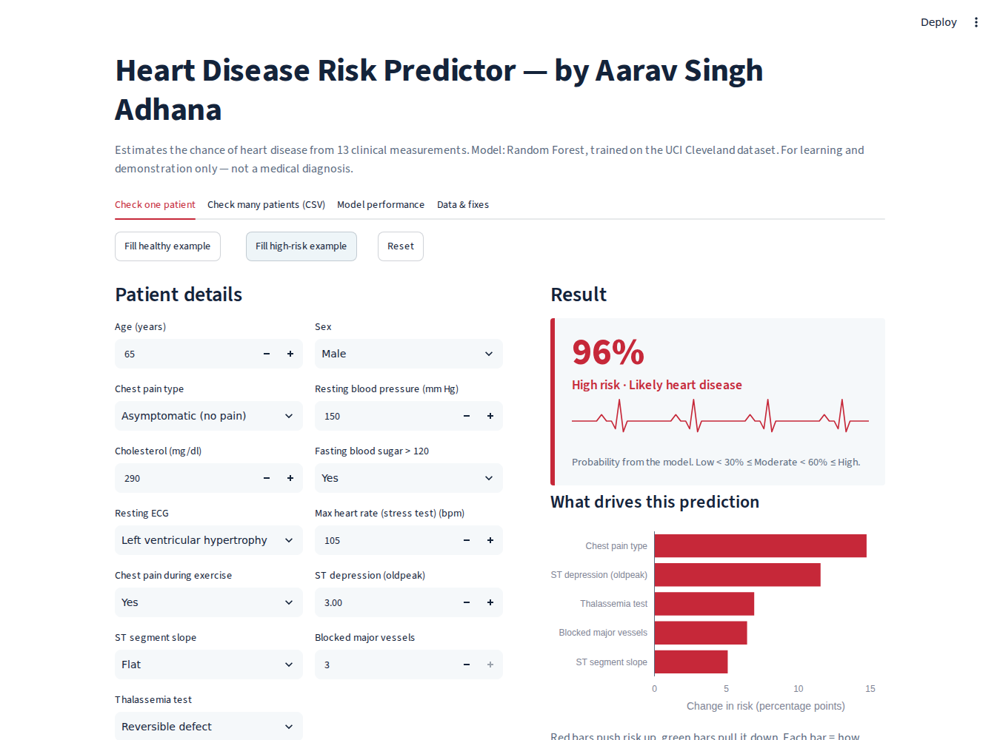
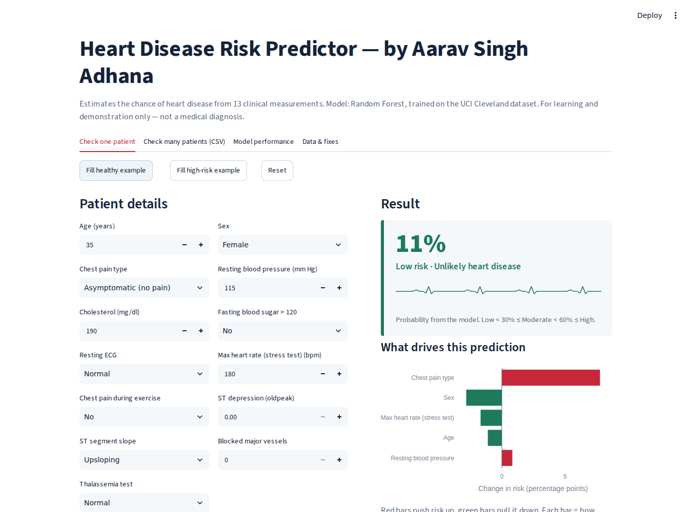
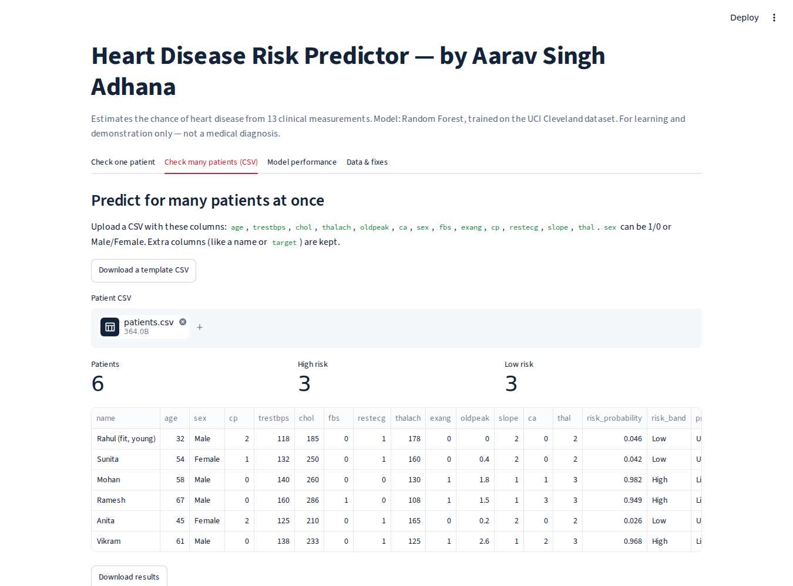
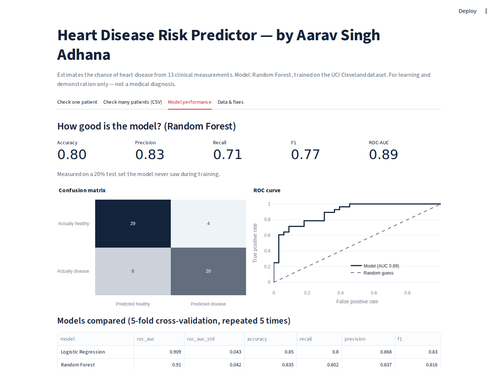
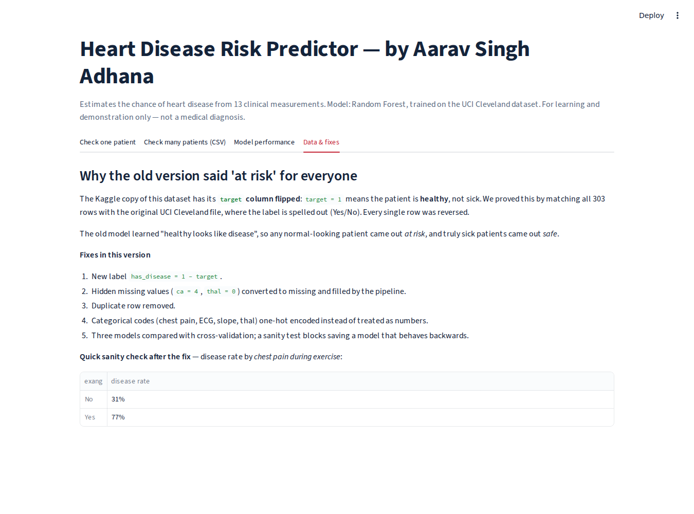

# 🫀 Early Heart Disease Prediction
https://heart-risk-aaravsinghadhana.streamlit.app/


An interactive machine learning app that estimates a patient's risk of heart
disease from 13 clinical measurements, explains **why** it made each
prediction, and scores whole CSV files of patients at once.

> ⚠️ For learning and demonstration only. This is not a medical diagnosis tool.



---

## Highlights

- **Found and fixed a critical data bug.** The widely used Kaggle `heart.csv`
  has its `target` label inverted. The original model therefore flagged healthy
  people as "at risk" and sick people as "safe", while still showing 83.6%
  accuracy. Full investigation: [docs/DATA_ISSUE_REPORT.md](docs/DATA_ISSUE_REPORT.md).
- **Leak-free scikit-learn pipeline:** imputation, scaling and one-hot encoding
  inside a single `Pipeline`.
- **Model selection** across Logistic Regression, Random Forest and Gradient
  Boosting using repeated stratified 5-fold cross-validation.
- **Explainable predictions:** each result shows which measurements push the
  risk up or down.
- **Batch scoring:** upload a CSV, download predictions.
- **Automated tests** (run on every push with GitHub Actions) that fail if the
  model ever behaves backwards again.

## Results

Measured on a 20% held-out test set (61 patients) the model never saw during training:

| Metric | Score |
|---|---|
| Accuracy | 0.80 |
| Precision | 0.83 |
| Recall | 0.71 |
| F1 | 0.77 |
| ROC-AUC | **0.89** |

Cross-validation (5-fold × 5 repeats, training set):

| Model | ROC-AUC | Accuracy |
|---|---|---|
| Logistic Regression | 0.909 ± 0.043 | 0.850 |
| **Random Forest (selected)** | **0.910 ± 0.042** | 0.835 |
| Gradient Boosting | 0.889 ± 0.045 | 0.816 |

Sanity check: a healthy 35-year-old scores **~11%** risk; a 65-year-old with
3 blocked vessels and exercise-induced angina scores **~96%**.

## Quick start

**Easiest (Windows):** double-click `run_app.bat`.
**Mac/Linux:** run `./run_app.sh`.

Or manually:

```bash
git clone https://github.com/<your-username>/heart-disease-predictor.git
cd heart-disease-predictor

python -m venv venv
venv\Scripts\activate            # Windows
# source venv/bin/activate       # Mac/Linux

pip install -r requirements.txt
streamlit run app.py             # opens http://localhost:8501
```

The trained model is included. If your scikit-learn version differs, the app
retrains automatically on first launch (about 15 seconds).

Other commands:

```bash
python train.py                  # retrain and print evaluation
python -m pytest -q              # run tests
python predict_cli.py --age 63 --sex Male --cp 0 --thalach 110 --exang 1 --oldpeak 2.5 --ca 2 --thal 3
python predict_cli.py --input-csv sample_data/patients.csv --output-csv predictions.csv
```

Step-by-step setup (Hinglish): [docs/SETUP_GUIDE.md](docs/SETUP_GUIDE.md)

## Screenshots

| Healthy patient | Batch prediction |
|---|---|
|  |  |

| Model performance | Data fixes |
|---|---|
|  |  |

## Project structure

```
heart-disease-predictor/
├── app.py                  # Streamlit web app (4 tabs)
├── train.py                # Clean → compare models → evaluate → save
├── predict_cli.py          # Command-line predictions
├── src/
│   ├── config.py           # Features, labels, code meanings, paths
│   ├── data.py             # Loading + cleaning (label fix)
│   └── model.py            # Pipelines, prediction, explanations
├── data/heart.csv          # Dataset
├── models/                 # Trained model + metrics.json
├── sample_data/patients.csv
├── tests/test_model.py     # Sanity tests
├── docs/                   # Documentation + screenshots
├── .github/workflows/      # Runs tests automatically on GitHub
├── run_app.bat / run_app.sh
└── requirements.txt
```

## Documentation

| Document | What's inside |
|---|---|
| [HOW_IT_WORKS.md](docs/HOW_IT_WORKS.md) | Architecture, pipeline, model choice, explanations |
| [DATA_ISSUE_REPORT.md](docs/DATA_ISSUE_REPORT.md) | How the inverted label was found and proven |
| [SETUP_GUIDE.md](docs/SETUP_GUIDE.md) | Install and run step by step, with common errors (Hinglish) |
| [GITHUB_AND_DEPLOY.md](docs/GITHUB_AND_DEPLOY.md) | Upload to GitHub and host free on Streamlit Cloud (Hinglish) |
| [INTERVIEW_GUIDE.md](docs/INTERVIEW_GUIDE.md) | Pitch, concepts, likely questions (Hinglish) |

## Input features

| Column | Meaning |
|---|---|
| age | Age in years |
| sex | 1 = male, 0 = female (or "Male"/"Female" in CSV) |
| cp | Chest pain: 0 asymptomatic, 1 atypical angina, 2 non-anginal, 3 typical angina |
| trestbps | Resting blood pressure (mm Hg) |
| chol | Serum cholesterol (mg/dl) |
| fbs | Fasting blood sugar > 120 mg/dl (1 = yes) |
| restecg | Resting ECG: 0 LV hypertrophy, 1 normal, 2 ST-T abnormality |
| thalach | Maximum heart rate in stress test |
| exang | Exercise-induced angina (1 = yes) |
| oldpeak | ST depression induced by exercise |
| slope | ST slope: 0 downsloping, 1 flat, 2 upsloping |
| ca | Major vessels coloured by fluoroscopy (0–3) |
| thal | 1 fixed defect, 2 normal, 3 reversible defect |

## Limitations

- Small (302 patients), older dataset from a single US hospital (Cleveland, 1988).
- Some inputs (`ca`, `thal`) need specialist tests not available at early screening.
- Recall of 0.71 means some true cases are missed; lowering the decision threshold
  would catch more at the cost of more false alarms.

## Dataset

UCI Heart Disease (Cleveland) — Janosi, Steinbrunn, Pfisterer & Detrano (1988),
UCI Machine Learning Repository. The copy in `data/` is the popular Kaggle
version; its label inversion is corrected in code (`src/data.py`).

## Author

**Aarav Singh Adhana**

## License

MIT — see [LICENSE](LICENSE).
