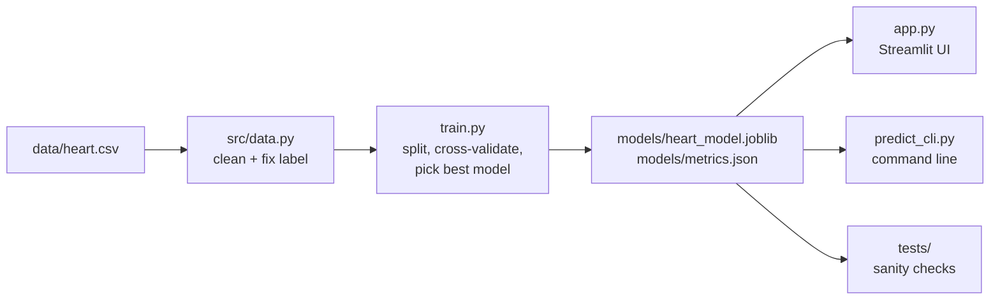

# How It Works

## Overview



| File | Responsibility |
|---|---|
| `src/config.py` | Single source of truth: feature lists, human-readable labels, code meanings, input ranges, file paths |
| `src/data.py` | Load CSV, fix the inverted label, turn hidden missing codes into NaN, drop duplicates |
| `src/model.py` | Build the preprocessing + model pipeline, load the model (retraining automatically if needed), predict, explain |
| `train.py` | End-to-end training: split → cross-validate 3 models → pick best → test → sanity check → retrain on all data → save |
| `app.py` | Interactive web app |
| `predict_cli.py` | Single-patient and CSV predictions from the terminal |

## 1. Data cleaning (`src/data.py`)

| Problem | Evidence | Fix |
|---|---|---|
| `target` is inverted | All 303 rows reversed versus original UCI labels | `has_disease = 1 - target` |
| `ca = 4` is really missing | Original UCI has `?` for these 5 rows | Set to NaN |
| `thal = 0` is really missing | Original UCI has `?` for these 2 rows | Set to NaN |
| 1 duplicate row | `df.duplicated()` | Dropped |

Result: 302 patients, 45.7% with heart disease (reasonably balanced).

## 2. Preprocessing pipeline (`src/model.py`)

```
ColumnTransformer
├── numeric  [age, trestbps, chol, thalach, oldpeak, ca] → median impute → StandardScaler
├── binary   [sex, fbs, exang]                           → passthrough
└── category [cp, restecg, slope, thal]                  → most-frequent impute → OneHotEncoder
```

- **One-hot encoding** for `cp`, `restecg`, `slope`, `thal`: these are category
  codes, not quantities. Treating "chest pain type 3" as three times "type 1"
  would be meaningless.
- **Median imputation** is robust to outliers (cholesterol goes up to 564).
- **Everything lives inside one `Pipeline`,** so during cross-validation the
  imputer and scaler are fit only on each training fold. This prevents data
  leakage, and the exact same transformation is applied at prediction time.

## 3. Model selection (`train.py`)

1. **Stratified 80/20 split.** The 20% test set is locked away until the very end.
2. **Repeated stratified 5-fold CV (×5)** on the training set for three candidates:
   - Logistic Regression (`C=0.5`)
   - Random Forest (300 trees, `max_depth=5`, `min_samples_leaf=5`)
   - Gradient Boosting (150 shallow trees, learning rate 0.05)

   Trees are kept shallow on purpose: with only ~240 training rows, deep trees memorise noise.
3. **Pick the highest mean ROC-AUC.** ROC-AUC measures ranking quality independent
   of the decision threshold. Random Forest (0.910) and Logistic Regression
   (0.909) are statistically tied; Random Forest was chosen by the rule.
4. **Evaluate once on the test set:** accuracy 0.80, ROC-AUC 0.89.
5. **Sanity check:** a clearly healthy and a clearly sick profile must score
   < 30% and > 70% respectively, otherwise the script refuses to save.
6. **Retrain on all 302 rows** for the deployed model and save it with the
   scikit-learn version, the healthy reference values, and training ranges.

## 4. Explanations

**Per-patient ("What drives this prediction")** — a what-if analysis. For each
feature, the patient's value is replaced by a *typical healthy value* (median or
most common value among healthy patients) and the change in predicted risk is
measured. Positive = that value raises risk.

**Global ("Which measurements matter most")** — permutation importance on the
test set: shuffle one feature and measure how much ROC-AUC drops.

## 5. Risk bands

| Probability | Band |
|---|---|
| < 30% | Low |
| 30–60% | Moderate |
| ≥ 60% | High |

The yes/no label uses a 0.5 threshold. In a real screening setting a lower
threshold would raise recall (fewer missed cases).

## 6. Robustness

- If `models/heart_model.joblib` is missing, unreadable, or saved with a different
  scikit-learn version, `load_bundle()` retrains automatically.
- CSV input accepts `sex` as 1/0 or Male/Female, keeps extra columns (like names),
  and fills blank cells with typical values.
- The app warns when an input is outside the range seen during training.

## 7. Tests (`tests/test_model.py`)

| Test | Guards against |
|---|---|
| `test_label_is_fixed` | Label inversion returning |
| `test_healthy_patient_is_low_risk` | Backwards model |
| `test_sick_patient_is_high_risk` | Backwards model |
| `test_not_everyone_at_risk` | The original "everyone at risk" bug |
| `test_more_blocked_vessels_raise_risk` | Nonsensical feature direction |
| `test_text_sex_and_missing_codes_accepted` | Input-handling crashes |
